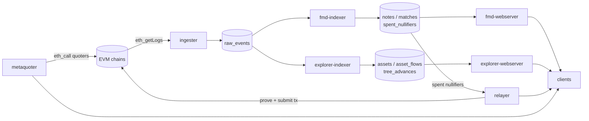
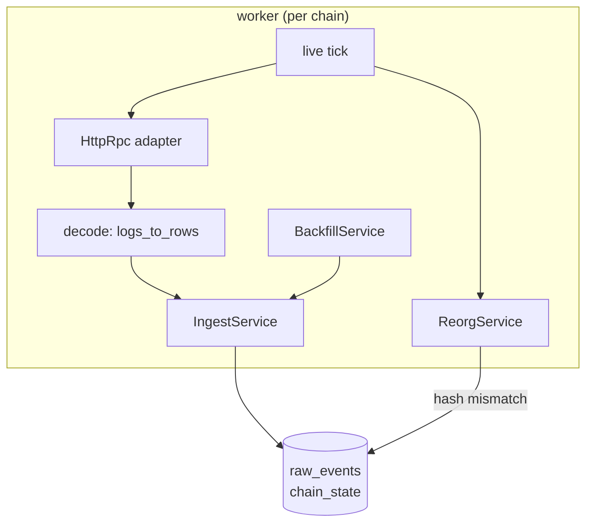
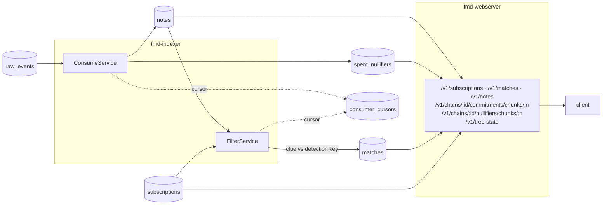
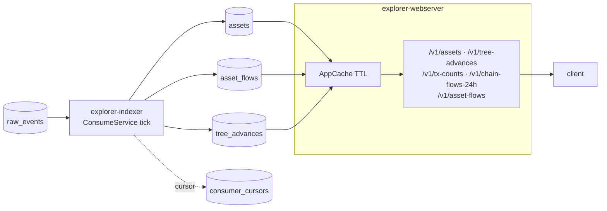
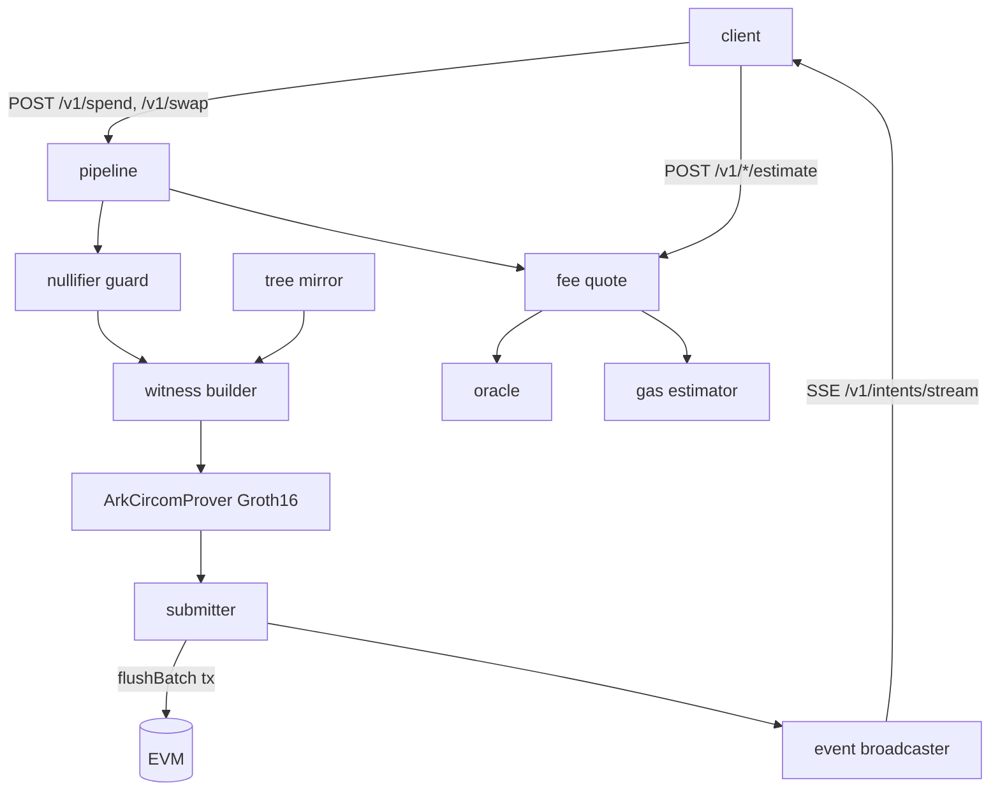
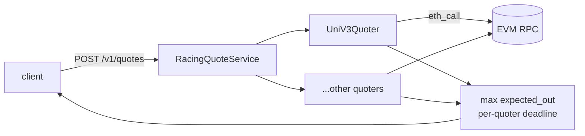
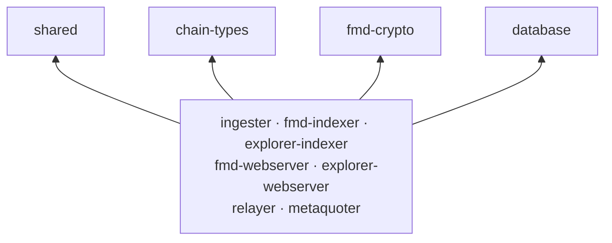

# Lelantos Backend

Rust workspace of backend services for Lelantos: EVM log ingestion, FMD (fuzzy message detection) indexing, explorer APIs, tree-advance relaying, and quote aggregation for shielded swaps.

See [ARCHITECTURE.md](ARCHITECTURE.md) for layering rules and conventions.

## System overview

Everything hangs off one Postgres. The `ingester` is the only writer of raw EVM
logs; every other indexer consumes them through a cursor and writes its own
derived tables, which the webservers read.



## Services

### Ingestion — `ingester`

One worker per configured chain. Live tail polls the tip, fetches logs since
the cursor, detects reorgs by comparing block hashes, and commits rows to
`raw_events` + `chain_state`. Backfill walks history in ranges through the same
ingest path. Decoding is delegated to `chain-types`.



### FMD — `fmd-indexer` + `fmd-webserver`

**Indexer.** Two tick loops over `raw_events`. *Consume* decodes
`IntentEscrowed` and nullifier events into `notes` and `spent_nullifiers`,
holding escrowed intents in a pending map until the batch that commits them
lands. *Filter* runs FMD detection: each note's clue is tested against every
active subscription key (`fmd-crypto`), producing `matches`. Both keep their own
row in `consumer_cursors`; filter also backfills new subscriptions over
historical notes. With the `parallel` feature the clue tests fan out over rayon.

**Webserver.** Read-only axum API over the same tables. Clients register a
detection key and get a capability token back; matches and note payloads are
fetched with it. Commitment and nullifier chunks are served as fixed-size pages
so a client can sync the tree locally. Cache-control is per route — token-keyed
routes are `no-store`, public ones are short-TTL.



### Explorer — `explorer-indexer` + `explorer-webserver`

**Indexer.** Single tick service, one pass per chain. Reads `raw_events` from
its cursor and projects public analytics tables: asset registrations, per-tx
in/out amounts, and tree-advance records (old root, new root, leaves inserted).

**Webserver.** Read-only axum API over those tables, with an in-process TTL
cache in front of the analytic aggregates.



### Relayer — `relayer`

The only service that writes on-chain. Clients POST a spend or swap payload; a
per-chain pipeline builds the witness against a mirrored copy of the commitment
tree, generates a Groth16 proof (ark-circom, serialized behind a mutex since it
is CPU-bound), and submits the batch transaction. Nullifier guard rejects
double-spends before proving, the oracle and gas estimator price the fee, and
successful flushes publish intent-lifecycle events on an SSE stream. The
`/estimate` routes run the same build without submitting.



### Metaquoter — `metaquoter`

DB-less quote aggregator. One POST gets raced against every quoter that
supports the requested chain (Uniswap V3 via `eth_call` today), each with its
own deadline; the best `expected_out` wins and slow quoters are dropped rather
than failing the request.



### Libraries

No IO loop of their own; every binary sits on top of them. `shared` holds
entities, shutdown, the tick driver, config loading and tracing init;
`chain-types` the ABI types and decoding; `fmd-crypto` the Poseidon / Baby
Jubjub / filter / tree primitives; `database` the Diesel schema, migrations,
bb8 pool and cursor repository. `integration-tests` drives the whole stack
end-to-end via testcontainers.



## Requirements

- Rust 1.95 (pinned via `rust-toolchain.toml`)
- [`just`](https://github.com/casey/just)
- Docker (local stack, integration tests)

## Development

```sh
just build    # cargo build --workspace
just test     # cargo test --workspace
just ci       # fmt + clippy + test
```

## Local stack

`stack/` runs the full system with Docker Compose: Postgres, an ephemeral Anvil node, contract deployment, and all services.

```sh
cd stack
just up               # everything (profile=all)
just up-profile fmd   # single profile: db | anvil | ingester | fmd | explorer | relayer | metaquoter
just logs <service>   # tail one service
just down             # stop + wipe volumes
```

The relayer needs circuit artifacts; `just up` fetches them automatically (`just fetch-circuits` to run manually). Service configs live in `stack/deploy/*.toml`.

## License

MIT OR Apache-2.0
