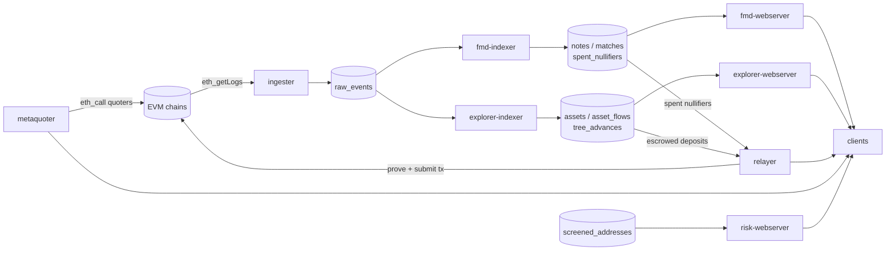
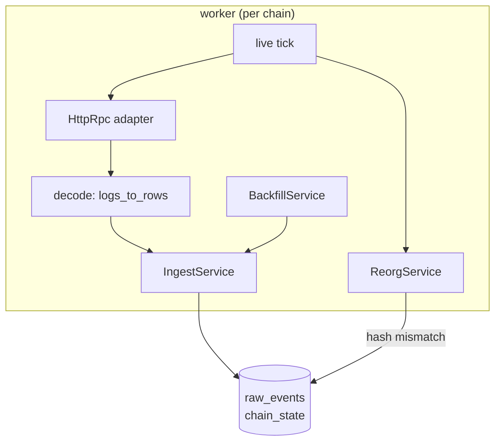
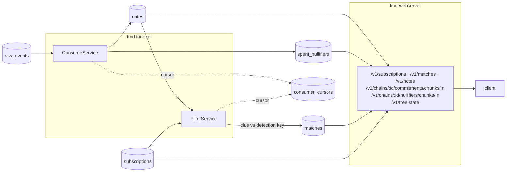
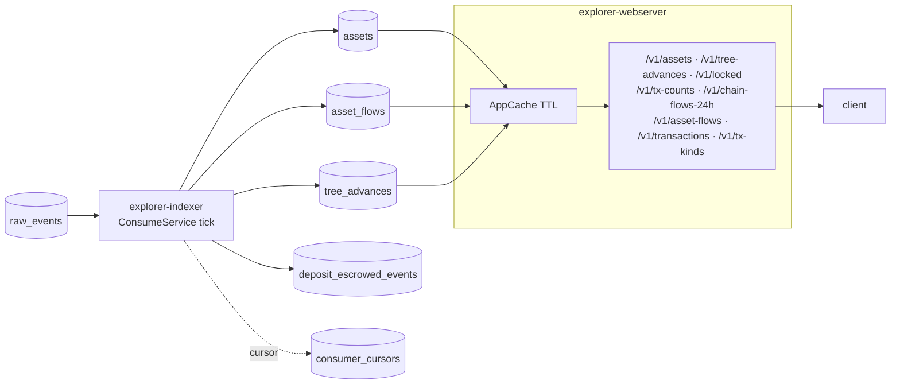
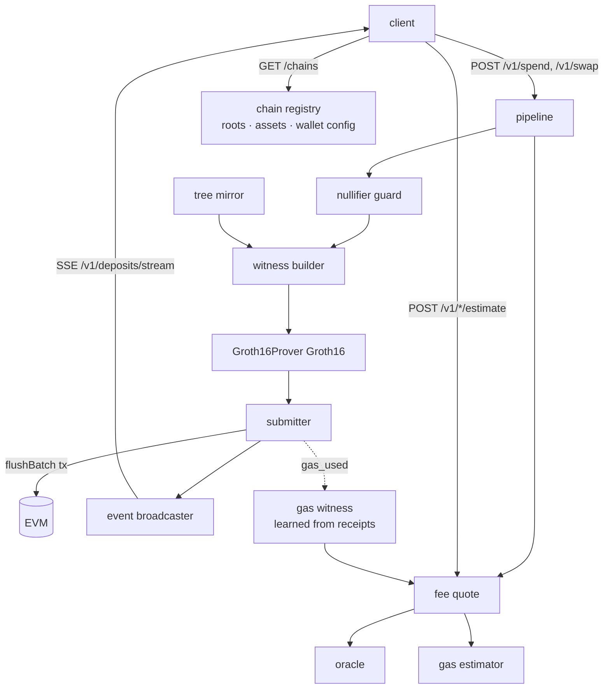
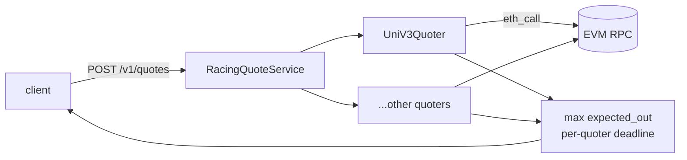
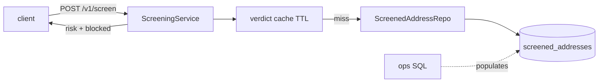
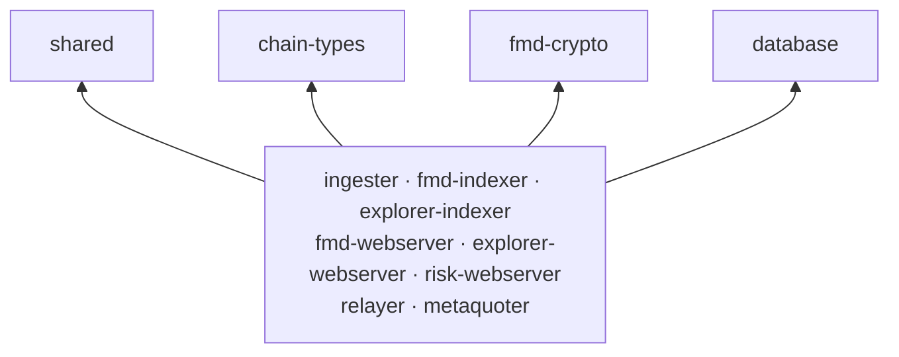

# Lelantos Backend

Rust workspace of backend services for Lelantos: EVM log ingestion, FMD (fuzzy message detection) indexing, explorer APIs, tree-advance relaying, and quote aggregation for shielded swaps.

See [ARCHITECTURE.md](ARCHITECTURE.md) for layering rules and conventions.

## System overview

Everything hangs off one Postgres. The `ingester` is the only writer of raw EVM
logs; every other indexer consumes them through a cursor and writes its own
derived tables, which the webservers read.



## Services

### Ingestion — `ingester`

One worker per configured chain. Live tail polls the tip, fetches logs since
the cursor, detects reorgs by comparing block hashes, and commits rows to
`raw_events` + `chain_state`. Backfill walks history in ranges through the same
ingest path. Decoding is delegated to `chain-types`.



### FMD — `fmd-indexer` + `fmd-webserver`

**Indexer.** Two tick loops over `raw_events`. *Consume* decodes
`DepositEscrowed` and nullifier events into `notes` and `spent_nullifiers`,
holding escrowed deposits in a pending map until the batch that commits them
lands. *Filter* runs FMD detection: each note's clue is tested against every
active subscription key (`fmd-crypto`), producing `matches`. Both keep their own
row in `consumer_cursors`; filter also backfills new subscriptions over
historical notes. With the `parallel` feature the clue tests fan out over rayon.

**Webserver.** Read-only axum API over the same tables. Clients register a
detection key and get a capability token back; matches and note payloads are
fetched with it. Commitment and nullifier chunks are served as fixed-size pages
so a client can sync the tree locally. Cache-control is per route — token-keyed
routes are `no-store`, public ones are short-TTL.



### Explorer — `explorer-indexer` + `explorer-webserver`

**Indexer.** Single tick service, one pass per chain. Reads `raw_events` from
its cursor and projects public analytics tables: asset registrations, per-tx
in/out amounts, and tree-advance records (old root, new root, leaves inserted).
It also maintains `deposit_escrowed_events`, the ledger the relayer's flush
worker drains — so this indexer feeds an on-chain writer, not only the API. It
refreshes three materialized views `CONCURRENTLY` at the end of a tick that
committed the events they derive from.

**Webserver.** Read-only axum API over those tables, with an in-process TTL
cache in front of the analytic aggregates.



### Relayer — `relayer`

The only service that writes on-chain. Clients POST a spend or swap payload; a
per-chain pipeline builds the witness against a mirrored copy of the commitment
tree, generates a Groth16 proof (ark-circom, serialized behind a mutex since it
is CPU-bound), and submits the batch transaction. Nullifier guard rejects
double-spends before proving, the oracle and gas estimator price the fee, and
successful flushes publish deposit-lifecycle events on an SSE stream. The
`/estimate` routes only validate the payload shape and quote — proving on an
unauthenticated request path is exactly what `gas_witness` exists to avoid.



### Metaquoter — `metaquoter`

DB-less quote aggregator. One POST gets raced against every quoter that
supports the requested chain (Uniswap V3 via `eth_call` today), each with its
own deadline; the best `expected_out` wins and slow quoters are dropped rather
than failing the request.



### Risk screening — `risk-webserver`

Read-only address screening over the `screened_addresses` table: given a chain
and an address, returns the highest risk across every source that lists it, and
whether that risk blocks. Addresses are normalized before lookup — EVM
addresses are lowercased so a checksummed and a lowercase spelling cannot screen
differently — and verdicts, negatives included, are cached with a TTL.

There is no write endpoint; the list is populated out-of-band by SQL. That is
what makes running it unauthenticated acceptable, since network reach cannot be
used to remove a sanctioned address. Screening is fail-closed: a DB error is a
500, never a "clean" verdict. It is the one webserver that runs migrations,
because no indexer writes its table.



### Libraries

No IO loop of their own; every binary sits on top of them. `shared` holds
entities, shutdown, the tick driver, config loading and tracing init (plus the
HTTP error type behind its `webserver` feature); `chain-types` the ABI types and
decoding; `fmd-crypto` the Poseidon / Baby Jubjub / filter / tree primitives;
`database` the Diesel schema, migrations, bb8 pool, cursor repository, advisory
locks and reorg retraction. `integration-tests` drives the whole stack
end-to-end via testcontainers.



## Crate READMEs

Each crate documents its own config, routes, and the decisions behind them.

| Crate | What it is |
|-------|-----------|
| [ingester](crates/ingester/README.md) | Live + backfill EVM log ingester, reorg detection |
| [fmd-indexer](crates/fmd-indexer/README.md) | FMD consume + filter loops |
| [fmd-webserver](crates/fmd-webserver/README.md) | FMD client API, capability tokens, chunk feeds |
| [explorer-indexer](crates/explorer-indexer/README.md) | Public projections + materialized views |
| [explorer-webserver](crates/explorer-webserver/README.md) | Explorer API, prices, tx classification |
| [relayer](crates/relayer/README.md) | Prover + submitter, flush worker, fee quotes |
| [metaquoter](crates/metaquoter/README.md) | DB-less swap quote aggregator |
| [risk-webserver](crates/risk-webserver/README.md) | Address screening |
| [shared](crates/shared/README.md) | Tick driver, shutdown, config, `AppError` |
| [chain-types](crates/chain-types/README.md) | Event ABI + decode |
| [fmd-crypto](crates/fmd-crypto/README.md) | FMD + Merkle primitives |
| [database](crates/database/README.md) | Schema, migrations, pool, cursors, reorg |
| [integration-tests](crates/integration-tests/README.md) | Cross-crate end-to-end |
| [stack](stack/README.md) | Local Docker Compose stack |

## Reorgs

The ingester is the only crate that *detects* a fork, but retraction is a
system-wide concern. Replacement `raw_events` rows get fresh, higher ids, so the
replay side takes care of itself; state already *derived* from the deleted rows
does not, since it sits below each consumer's cursor. The ingester therefore
records every fork in `chain_reorgs`, and each consumer calls
`database::reorg::apply_pending` at the top of its tick to drop its own derived
rows and rewind. See [database](crates/database/README.md#reorg-retraction).

## Replicas

| Service | Safe replica count |
|---------|-------------------|
| `ingester`, `fmd-indexer` | N, as **failover** — a Postgres advisory lock elects one leader per chain; the rest skip their tick. Throughput per chain stays 1x |
| `fmd-webserver`, `explorer-webserver`, `risk-webserver`, `metaquoter` | N, freely — stateless reads |
| `relayer` | **1 per chain.** The tree mirror, nullifier guard, and idempotency cache are per-process, and there is no lock |

## Requirements

- Rust 1.95 (pinned via `rust-toolchain.toml`)
- [`just`](https://github.com/casey/just)
- Docker (local stack, integration tests)
- `protoc` and libclang (`brew install protobuf llvm` /
  `apt-get install protobuf-compiler libclang-dev`) — the relayer's
  `circom-witnesscalc` build script generates its witness-graph reader with
  prost-build and bindgen

## Development

```sh
just build    # cargo build --workspace
just test     # cargo test --workspace
just ci       # fmt + clippy + test
```

## Local stack

`stack/` runs the full system with Docker Compose: Postgres, an ephemeral Anvil node, contract deployment, and all services.

```sh
cd stack
just up               # everything (profile=all)
just up-profile fmd   # single profile: db | anvil | ingester | fmd | explorer | relayer | metaquoter | risk
just logs <service>   # tail one service
just down             # stop + wipe volumes
just --list           # everything else
```

The relayer needs circuit artifacts; `just up` fetches them automatically (`just fetch-circuits` to run manually).

### Layout

```
stack/
  config/dev/     service TOMLs for the local anvil stack   (mounted by default)
  config/prod/    deployment templates, real chains         (STACK_ENV=prod)
  scripts/        deploy-contracts.sh, fetch-circuits.sh, lib.sh
  circuits/       downloaded proving artifacts (gitignored)
```

`STACK_ENV` picks which `config/<env>/` directory the services mount, defaulting to `dev`:

```sh
just up                    # config/dev/  — anvil, chain 31337
STACK_ENV=prod just up      # config/prod/ — mainnet templates
```

The dev configs declare a chain `31337` block whose addresses are placeholders. The `deploy` one-shot deploys the contracts to anvil and writes `addresses.env`, which every backend sources at startup to overlay the real addresses. That overlay (`apply_env_overlay`) only rewrites chains **already declared** in the TOML — removing the `31337` block silently discards the deploy output rather than erroring.

### Debugging

```sh
just env               # resolved PROFILE / STACK_ENV / active config dir
just check             # validate compose (both envs), scripts and every TOML
just addresses         # dump addresses.env written by the deploy one-shot
just deploy-logs       # contract addresses, funding, and errors from `deploy`
just show-config <svc> # the TOML a running service actually mounted
DEBUG=1 just up        # verbose script output (TRACE=1 also enables `set -x`)
```

`scripts/deploy-contracts.sh` keeps its full forge output in the container at `/tmp/forge.log` and the parsed address table at `/tmp/addresses.parsed`. Its paths are env-overridable (`CONTRACTS_DIR`, `WORK_DIR`, `OUT_FILE`, `CHAIN_ID`), so it can also be run outside the container against any RPC.

## License

MIT OR Apache-2.0
